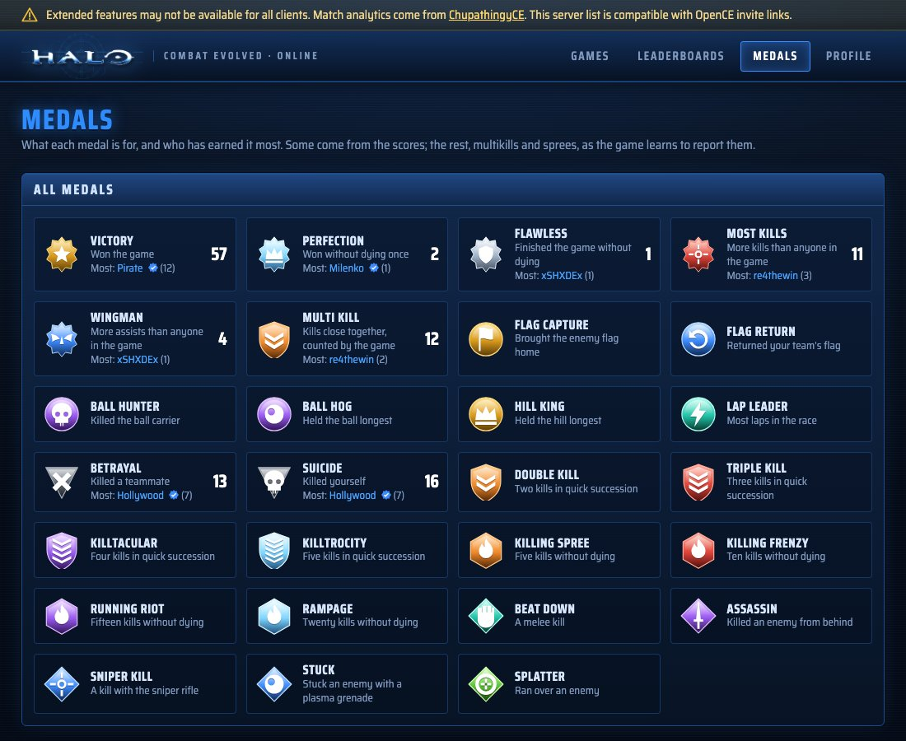

<p align="center"></p>

<h1 align="center">ChupathingyCE</h1>

<p align="center"><b>Halo: Combat Evolved on Windows, Mac, Linux and Android, with online play that just works.</b></p>

<p align="center">
<a href="https://github.com/ChupathingyCE/chupathingyce/releases/latest">Download</a> ·
<a href="https://halo.milenko.org">Games online now</a>
</p>

> **Compatible with [OpenCE](https://github.com/cybersecurity/halo-ce-universal) build-55 through build-65 (network version 9).**
> Players on OpenCE and players on ChupathingyCE play together.

ChupathingyCE is a community build of **OpenCE**, the port of the Halo: Combat
Evolved decompilation to modern computers and phones. We follow OpenCE closely,
send our fixes back to it, and add things on top: a server list, dedicated
servers, stats and service records, and a native Mac version. It's not a rival
to OpenCE; it's a stable build you can count on, with its own releases.

<p align="center"></p>

## What you get

- **The whole game**: the campaign, split screen, and System Link multiplayer,
  running natively. No emulator.
- **Online Games**: a server list in the Multiplayer menu. Pick a game and you're
  in, or press **Y** to host your own and it shows up for everyone.
- **Play with anyone**: games go straight between players' computers. No port
  forwarding in most homes.
- **Stats and service records** at [halo.milenko.org](https://halo.milenko.org):
  every finished game gets a carnage report with medals, and your games add up
  on your service record and the leaderboards.
- **Your own account**: make one on the site (or from the game), and back up
  your player identity so a reinstall keeps your record.
- **Dedicated servers**: anyone can run a server that hosts games around the
  clock. See [server/README.md](server/README.md).
- **High-res HUD and text**, widescreen menus, and controller prompts for
  Xbox, PlayStation and Nintendo pads.

## Download

Get the latest release from the [Releases page](https://github.com/ChupathingyCE/chupathingyce/releases/latest):

| Platform | Download | Notes |
| --- | --- | --- |
| Windows | `chupathingyce-windows-release.zip` | Windows 10 or later. |
| Linux | `chupathingyce-linux-release.zip` | Needs SDL3 (32-bit). See [port/linux/README.md](port/linux/README.md). |
| Android | `chupathingyce-android-release.zip` | Android 9 or later, 64-bit. See [port/android/README.md](port/android/README.md). |
| Mac | Coming with the first release | Apple silicon. Build it yourself for now: [port/macos/README.md](port/macos/README.md). |

The game checks for new releases when it starts and asks before updating.
Windows may warn that the app is from an unknown publisher: choose
**More info → Run anyway**.

## You need your own copy of Halo

ChupathingyCE doesn't include the game's maps, sounds or art. You need an Xbox
disc image (`.iso` or `.xiso`) of Halo: Combat Evolved. Any region works.

1. Start ChupathingyCE.
2. The first time, it asks for your disc image. Pick it.
3. It copies the game's `maps` folder out of the image (about 2 GB), then starts.

On Android, copy the disc image to your phone first.

## Playing online

| You want to | Do this |
| --- | --- |
| Join a game | **Multiplayer → Online Games**, pick a game, press **A**. Or press **Join** on [halo.milenko.org](https://halo.milenko.org). |
| Host a game | **Multiplayer → Online Games → Y (Create Game)**, or host from System Link as usual. Your game is listed online by itself. |
| Invite a friend | When you host, the game copies an invite link (`halo://join/…`). Send it; opening it joins your game. |
| See your stats | Your service record is on [halo.milenko.org](https://halo.milenko.org), found by your name. |
| Make an account | On [halo.milenko.org/profile](https://halo.milenko.org/profile), or press **Start** in Online Games to make one for the player you already are. |
| List a game from an OpenCE build | Sign in on the site, open **Host a Game**, and paste your invite link. |

Everything here plays with OpenCE builds of the same network version: they can
join your games and you can join theirs. Stats and the server list need a
ChupathingyCE host. Games hosted from OpenCE builds can still be listed by
their host on the site (Host a Game).

<p align="center">


</p>

## Run a server

A dedicated server is a copy of the game with no player and no window, hosting
a playlist of games around the clock and listing them on the server list. It
runs on any Linux server with Docker, or on your own computer. See
[server/README.md](server/README.md).

## How ChupathingyCE relates to OpenCE

- OpenCE ([cybersecurity/halo-ce-universal](https://github.com/cybersecurity/halo-ce-universal))
  is where the port is made. ChupathingyCE merges its changes regularly.
- We keep the same network version, so players of both play together. The line
  at the top of this page says which OpenCE builds match this one.
- Fixes to the shared game code go back to OpenCE as pull requests.
- ChupathingyCE has its own version numbers (this is v0.5.0b) and its own
  releases, so it doesn't change under you every few hours.

## Building it yourself

You need Python 3, [ninja](https://ninja-build.org/) and clang. The game
supplies the Xbox SDK declarations it uses, so you don't need the SDK.

```sh
python3 configure.py
ninja            # the game for the computer you're on
```

| Target | Result | Instructions |
| --- | --- | --- |
| `ninja macos` | `build/macos/ChupathingyCE.app` | [port/macos/README.md](port/macos/README.md) |
| `ninja linux` | `build/linux/halo` | [port/linux/README.md](port/linux/README.md) |
| `ninja windows` | `build/windows/halo.exe` | [port/windows/README.md](port/windows/README.md) |
| `ninja android_apk` | the Android app | [port/android/README.md](port/android/README.md) |

Useful `configure.py` options:

| Option | What it does |
| --- | --- |
| `--release` | A release build, as players get. Without it, a failed check stops the game. |
| `--portable` | A Linux or Windows build that runs on any x86-64 computer, to give to others. |
| `--no-game-browser` | Leaves out the server list, stats and dedicated servers, as OpenCE's builds are. |
| `--pgo=off`, `--lto=off` | Faster builds, without profile-guided or link-time optimisation. |

The version being made is in `VERSION`. Releases are built and published by
the project's release workflow; the builds on this repository's Actions page
are for checking changes.

## Credits

- The decompilation: [punpckhdq/halo](https://github.com/punpckhdq/halo) and
  [bnunu/halo-1](https://github.com/bnunu/halo-1), of the Xbox build 2342.
- The port: [OpenCE](https://github.com/cybersecurity/halo-ce-universal) and
  its contributors.
- ChupathingyCE: [Milenko](https://github.com/MrMilenko) and contributors. The
  icon is MrBruh's helmet, with tusks.
- Fonts: [Noto Sans](https://fonts.google.com/noto) (SIL OFL) and
  [Kenney's Input Prompts](https://kenney.nl/assets/input-prompts) (CC0).
- Libraries: SDL3, stb, Mbed TLS, miniupnpc, KCP, tomlc17, musl's maths, and
  extract-xiso. Their licenses are beside them in `port/third_party`.

Halo is a trademark of Microsoft. ChupathingyCE is a fan project, not made or
endorsed by Microsoft, Bungie or 343 Industries, and includes none of the
game's content. The code is released under [CC0](LICENSE.md).
